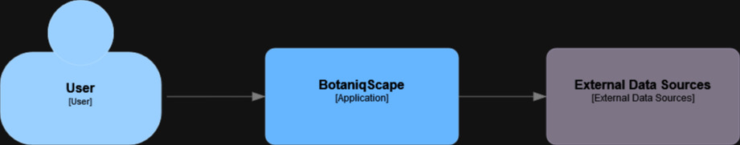
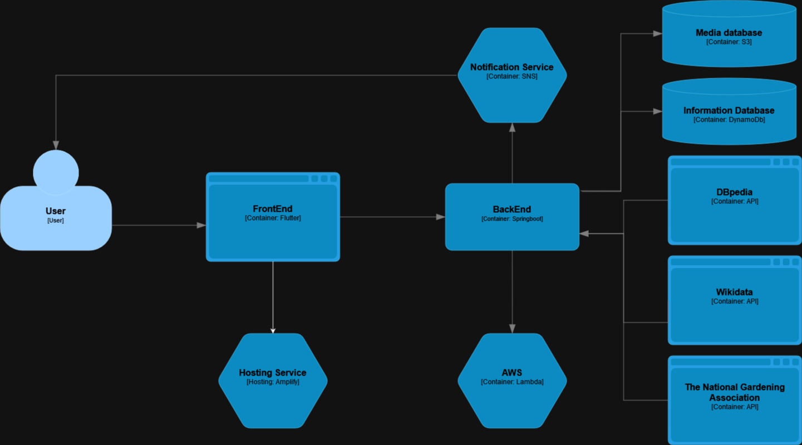

  
  <h1>WADE-Botanical-Gardens-Smart-Explorer</h1>
  
  

    An awesome README template for your projects! 
  

  

  
  
  
  
  
  

   
<h4>
    <a href="https://github.com/Alex-Amarandei/WADE-Botanical-Gardens-Smart-Explorer/blob/main/docs/src/index.html">Scholarly HTML Report</a>
   · 
    <a href="https://github.com/Alex-Amarandei/WADE-Botanical-Gardens-Smart-Explorer/blob/main/docs/src/index.md">Scholarly Markdown Report</a>
   · 
    <a href="https://github.com/Alex-Amarandei/WADE-Botanical-Gardens-Smart-Explorer/issues">Report Bug</a>
   · 
    <a href="https://github.com/Alex-Amarandei/WADE-Botanical-Gardens-Smart-Explorer/issues">Request Feature</a>
  </h4>

 

# :notebook_with_decorative_cover: Table of Contents

-   [About the Project](#star2-about-the-project)
    -   [Screenshots](#camera-screenshots)
    -   [Tech Stack](#space_invader-tech-stack)
    -   [Features](#dart-features)
-   [Getting Started](#toolbox-getting-started)
    -   [Prerequisites](#bangbang-prerequisites)
    -   [Installation](#gear-installation)
    -   [Running Tests](#test_tube-running-tests)
    -   [Run Locally](#running-run-locally)
    -   [Deployment](#triangular_flag_on_post-deployment)
-   [Roadmap](#compass-roadmap)
-   [Contributing](#wave-contributing)
-   [FAQ](#grey_question-faq)
-   [License](#warning-license)
-   [Contact](#handshake-contact)
-   [Acknowledgements](#gem-acknowledgements)

## :star2: About the Project

### :camera: Logo

 
  

### :camera: Diagrams

 
  
  

### :camera: OpenAPI Specification

You can find our [OpenAPI]() specification here.

#### Instructions

-   Head over to the [Swagger Website](https://editor.swagger.io/)
-   Paste the code in [BotaniqScape-API.yaml](https://github.com/Alex-Amarandei/WADE-Botanical-Gardens-Smart-Explorer/blob/main/docs/openAPI/BotaniqScape-API.yaml)
-   That's it!

### :space_invader: Tech Stack

  
Client

  <ul>
    <li><a href="https://flutter.dev/">Flutter</a></li>
    <li><a href="https://dart.dev/">Dart</a></li>
    <li><a href="https://aws.amazon.com/amplify/">AWS Amplify</a></li>
  </ul>

  
Server

  <ul>
    <li><a href="https://www.java.com/en/">Java</a></li>
    <li><a href="https://spring.io/">Spring</a></li>
    <li><a href="https://aws.amazon.com/lambda/">Lambda</a></li>
    <li><a href="https://aws.amazon.com/iam/">IAM Roles</a></li>
    <li><a href="https://aws.amazon.com/sns/">SNS</a></li>
  </ul>

Database

  <ul>
    <li><a href="https://aws.amazon.com/dynamodb/">DynamoDB</a></li>
    <li><a href="https://aws.amazon.com/s3/">S3</a></li>
  </ul>

### :dart: Features

-   Botanical Gardens Explorer
-   Botanical Garden Events Explorer
-   Botanical Garden Exhibitions Explorer
-   Botanical Garden Plants Explorer
-   Events Notifications
-   Reviews and User Interactions
-   ChatGPT-powered AI Assistant
-   <a href="https://www.wikidata.org/wiki/Wikidata:Main_Page">Wikidata</a>, <a href="https://www.dbpedia.org/">DBpedia</a>, <a href="https://www.garden.org/">garden.org</a> queries

## :toolbox: Getting Started

### :bangbang: Prerequisites

:construction: Work in Progress

### :gear: Installation

:construction: Work in Progress

### :test_tube: Running Tests

:construction: Work in Progress

### :running: Run Locally

:construction: Work in Progress

### :triangular_flag_on_post: Deployment

:construction: Work in Progress

## :compass: Roadmap

-   [x] Phase 1
    -   [x] A general architecture of the Web application to be developed
    -   [x] An OpenAPI specification regarding the REST API
    -   [x] A Scholarly HTML technical report
    -   [x] Public Progress Wiki

> Note: The milestones below will be updated periodically as steps will become increasingly clearer

-   [ ] Phase 2
    -   [ ] Main Functionalities
    -   [ ] Deployment
    -   [ ] Integrations via SPARQL queries
    -   [ ] Updated Documentation

## :wave: Contributing

Contributions are always welcome!

## :grey_question: FAQ

:construction: Work in Progress

## :warning: License

Distributed under the [MIT License](https://opensource.org/license/mit/). See [LICENSE](https://github.com/Alex-Amarandei/WADE-Botanical-Gardens-Smart-Explorer/blob/main/LICENSE) for more information.

## :handshake: Contact

Alex Amarandei - [@alex-amarandei](https://www.linkedin.com/in/alex-amarandei/) - alex.m.amarandei@gmail.com

Andrei Zaharia - [@andrei-zaharia](https://www.linkedin.com/in/andrei-zaharia-a34aa217a/) - andreizaharialucian@gmail.com

## :gem: Acknowledgements

-   [gitmoji](https://gitmoji.dev/)
-   [Readme Template](https://github.com/Louis3797/awesome-readme-template#readme)
