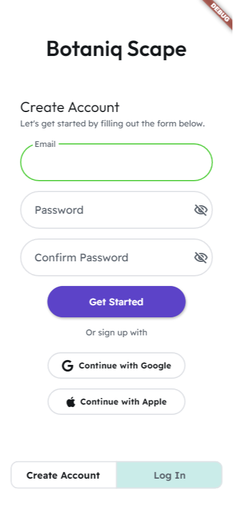
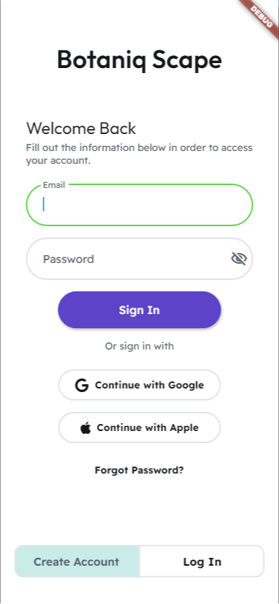
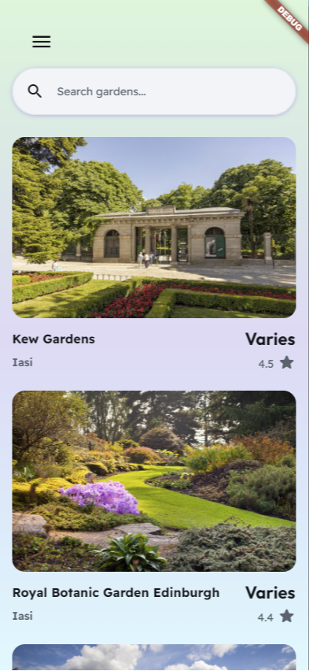
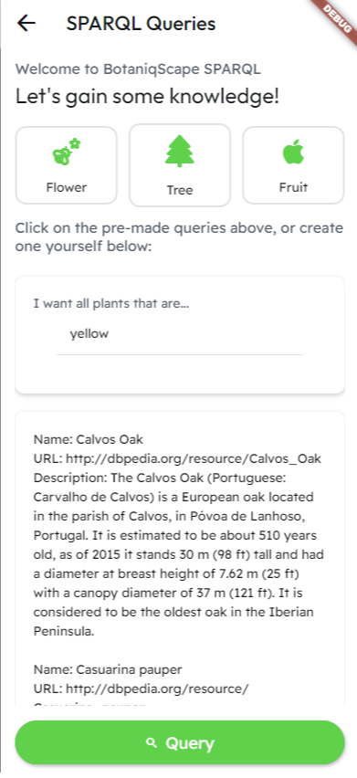
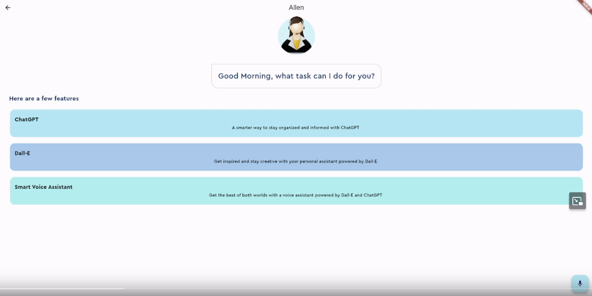
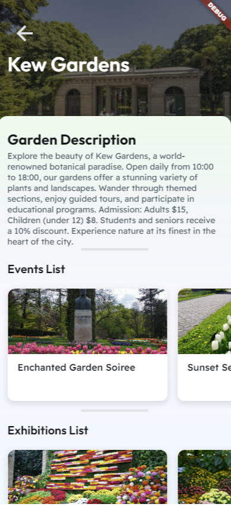
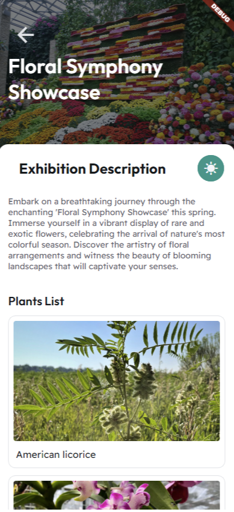
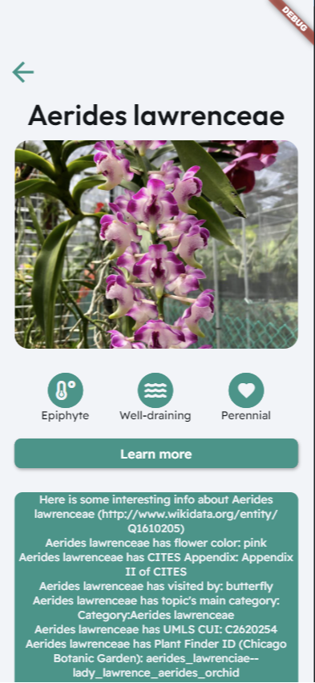

  
  <h1>WADE-Botanical-Gardens-Smart-Explorer</h1>
  
  

    An awesome README template for your projects! 
  

  

  
  
  
  
  
  

   
<h4>
    <a href="https://github.com/Alex-Amarandei/WADE-Botanical-Gardens-Smart-Explorer/blob/main/docs/src/index.html">Scholarly HTML Report</a>
   · 
    <a href="https://github.com/Alex-Amarandei/WADE-Botanical-Gardens-Smart-Explorer/blob/main/docs/src/index.md">Scholarly Markdown Report</a>
   · 
    <a href="https://github.com/Alex-Amarandei/WADE-Botanical-Gardens-Smart-Explorer/issues">Report Bug</a>
   · 
    <a href="https://github.com/Alex-Amarandei/WADE-Botanical-Gardens-Smart-Explorer/issues">Request Feature</a>
  </h4>

 

# :notebook_with_decorative_cover: Table of Contents

-   [About the Project](#star2-about-the-project)
    -   [Screenshots](#camera-screenshots)
    -   [Tech Stack](#space_invader-tech-stack)
    -   [Features](#dart-features)
-   [Getting Started](#toolbox-getting-started)
    -   [Prerequisites](#bangbang-prerequisites)
    -   [Installation](#gear-installation)
    -   [Running Tests](#test_tube-running-tests)
    -   [Run Locally](#running-run-locally)
    -   [Deployment](#triangular_flag_on_post-deployment)
-   [Roadmap](#compass-roadmap)
-   [Contributing](#wave-contributing)
-   [FAQ](#grey_question-faq)
-   [License](#warning-license)
-   [Contact](#handshake-contact)
-   [Acknowledgements](#gem-acknowledgements)

## :star2: About the Project

### :camera: Logo

 
  

### :camera: Diagrams

 
  
  

### :camera: OpenAPI Specification

You can find our [OpenAPI]() specification here.

#### Instructions

-   Head over to the [Swagger Website](https://editor.swagger.io/)
-   Paste the code in [BotaniqScape-API.yaml](https://github.com/Alex-Amarandei/WADE-Botanical-Gardens-Smart-Explorer/tree/main/docs/openAPI/BotaniqScape-API.yaml)
-   That's it!

### :space_invader: Tech Stack

  
Client

  <ul>
    <li><a href="https://flutter.dev/">Flutter</a></li>
    <li><a href="https://dart.dev/">Dart</a></li>
    <li><a href="https://aws.amazon.com/amplify/">AWS Amplify</a></li>
  </ul>

  
Server

  <ul>
    <li><a href="https://www.java.com/en/">Java</a></li>
    <li><a href="https://spring.io/">Spring</a></li>
    <li><a href="https://aws.amazon.com/lambda/">Lambda</a></li>
    <li><a href="https://aws.amazon.com/iam/">IAM Roles</a></li>
    <li><a href="https://aws.amazon.com/sns/">SNS</a></li>
  </ul>

Database

  <ul>
    <li><a href="https://aws.amazon.com/dynamodb/">DynamoDB</a></li>
    <li><a href="https://aws.amazon.com/s3/">S3</a></li>
  </ul>

### :dart: Features

-   Botanical Gardens Explorer
-   Botanical Garden Events Explorer
-   Botanical Garden Exhibitions Explorer
-   Botanical Garden Plants Explorer
-   Events Notifications
-   Reviews and User Interactions
-   ChatGPT-powered AI Assistant
-   <a href="https://www.wikidata.org/wiki/Wikidata:Main_Page">Wikidata</a>, <a href="https://www.dbpedia.org/">DBpedia</a>, <a href="https://www.garden.org/">garden.org</a> queries

## :toolbox: Getting Started

User Guide for BotaniqScape

Welcome to BotaniqScape, the comprehensive app for exploring gardens, exhibitions, and plant-related information. This guide will help you navigate the app with ease, whether you're a new user or just looking for more information.

## Getting Started

### Installation and Access

- **Mobile Version**: Download the app from your device's app store.
- **Web Version**: Access the app through its website.

### Home Page

Upon entering the app, you are presented with two main options:

1. **Visit Us Button**: Click this to visit the app's GitHub repository.
2. **Auth Page**: Navigate here to create an account or log in.

### Authentication Page

- **Create an Account**: If you're a new user, sign up by providing the necessary details.
- **Log In**: Existing users can log in using their credentials.

## Main Features

### Browsing Gardens

On the main page, you can explore various gardens. Click on a garden to see its events, exhibitions, and detailed information.

### Events and Exhibitions

- **Events**: Clicking on an event redirects you to its social media page for more details.
- **Exhibitions**: Select an exhibition to view its page within the app, where you can:
  - Read about the exhibition.
  - See all plants featured in it.
  - Click on a plant to learn more about it.

### Burger Menu

- Access your personal information via the burger menu.
- **AI Voice Assistant**: Interact with the app using voice commands through this feature.
- **SPARQL Page**: Here, you can:
  - Execute one of three pre-made queries about plants.
  - Create and run your own queries to retrieve plant information.

## Learning More about Plants

- **From Exhibition to Plant Details**: While exploring an exhibition, you can click on any plant to navigate to its specific page.
- **Detailed Plant Information**: On the plant's page, select “Learn More” to perform a SPARQL query. This action gathers all available data about the selected plant, offering in-depth information.

## Tips for a Better Experience

- **Regular Updates**: Keep the app updated for the latest features and improvements.
- **Feedback**: Use the 'Visit Us' feature for any queries or feedback.

## Troubleshooting

If you encounter any issues, refer to the 'Visit Us' section in the app or contact customer support.

Thank you for choosing BotaniqScape. We hope you enjoy exploring the world of gardens and plants with us!

## Screenshots

## :compass: Roadmap

-   [x] Phase 1
    -   [x] A general architecture of the Web application to be developed
    -   [x] An OpenAPI specification regarding the REST API
    -   [x] A Scholarly HTML technical report
    -   [x] Public Progress Wiki

> Note: The milestones below will be updated periodically as steps will become increasingly clearer

-   [x] Phase 2
    -   [x] Main Functionalities
    -   [x] Deployment
    -   [x] Integrations via SPARQL queries
    -   [x] Updated Documentation

## :wave: Contributing

Contributions are always welcome!

## :warning: License

Distributed under the [MIT License](https://opensource.org/license/mit/). See [LICENSE](https://github.com/Alex-Amarandei/WADE-Botanical-Gardens-Smart-Explorer/blob/main/LICENSE) for more information.

## :handshake: Contact

Alex Amarandei - [@alex-amarandei](https://www.linkedin.com/in/alex-amarandei/) - alex.m.amarandei@gmail.com

Andrei Zaharia - [@andrei-zaharia](https://www.linkedin.com/in/andrei-zaharia-a34aa217a/) - andreizaharialucian@gmail.com

## :gem: Acknowledgements

-   [gitmoji](https://gitmoji.dev/)
-   [Readme Template](https://github.com/Louis3797/awesome-readme-template#readme)
